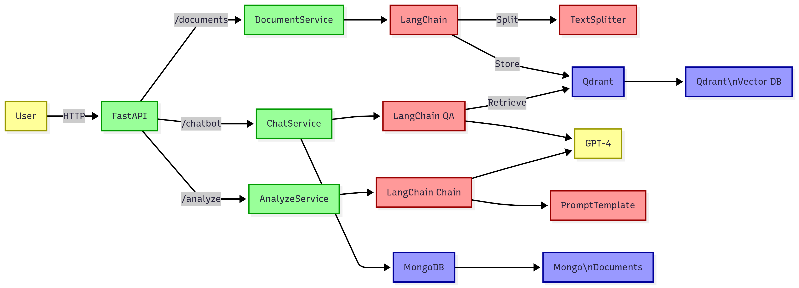

# Chatbot API with FastAPI, Qdrant and OpenAI


An intelligent chatbot API that provides:
- Document upload and indexing (PDF, Word, HTML, text)
- Contextual conversations based on documents
- Chat transcript analysis

## Architecture



Key Components:
1. **FastAPI** - REST API framework
2. **Document Service** - Handles file uploads and processing
3. **Chat Service** - Manages conversational AI interactions
4. **Analyze Service** - Provides chat transcript evaluation
5. **Qdrant** - Vector database for semantic search
6. **MongoDB** - Document storage and chat history
7. **OpenAI** - For embeddings and LLM completions

## Features

- **Document Management**:
  - File upload (PDF, DOCX, HTML, TXT)
  - Text extraction and embedding generation
  - Storage in Qdrant (vectors) and MongoDB (raw content)

- **Intelligent Chat**:
  - Context-aware responses based on uploaded documents
  - Semantic search via Qdrant
  - Conversation history in MongoDB

- **Transcript Analysis**:
  - Automatic conversation evaluation
  - AI-generated improvement suggestions

## Installation

1. Clone the repository:
```bash
git clone https://github.com/YassmineEm/SupportAI.git
